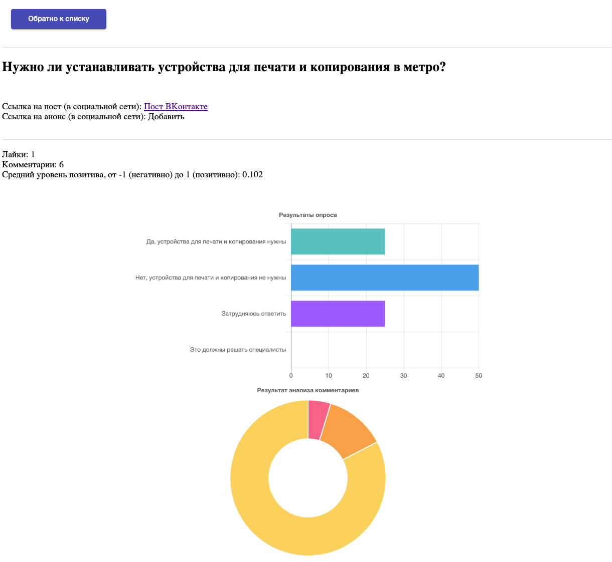

# Секция "ГОСУДАРСТВЕННОЕ УПРАВЛЕНИЕ И УСЛУГИ"

Данный репозиторий содержит решение команды "ЦуП" в рамках
36-часового хакатона
[Цифровой прорыв 2019](https://xn--b1aaqfxbbhefb3bya5f.xn--p1ai/)

## Состав команды

1. Белов Сергей (капитан)
[fb](https://www.facebook.com/profile.php?id=100002394559660)
2. Демидовский Александр (разработчик клиентской и серверной части)
[vk](https://vk.com/demid5111)
3. Земсков Владимир (верстальщик)
4. Никитин Иван (бизнес-аналитик)
5. Колчина Мария (бизнес-аналитик)

## Проблема

* Сложности коммуникации при обсуждении и принятии решений по социально
значимым проблемам.

* Сложность составления и обработки коллективных обращений. Недостаток
активности граждан в местном и региональном самоуправлении.

## Задача

* Предложить прототип ПО, которое позволит использовать
информационно-коммуникационные технологий (ИКТ) для совместного
принятия решений, развития местного и регионального самоуправления.

* Предусмотреть возможность отслеживания состояния работ по
принятым решениям.

## Требования к результату

* Использование цифровых технологий для улучшения процессов принятия
коллективных решений

* Мотивация пользователей (граждан) к активному участию в общественных
процессах
* Необходимо учитывать юридические требования текущего законодательства

## Техническая информация

1. Добавьте файл `.secret_access_token`
в корень проекта. Файл содержит `access_token` зарегистрированного
приложения в ВКонтакте
2. Добавьте файл `.secret_sentiment_token`
в корень проекта. Файл содержит `token` зарегистрированного
пользователя сервиса [tt-api.tech](https://tt-api.tech)
2. `pip3 install -r requirements.txt`
3. `cd ui2`
4. `npm install`
5. `npm start`
6. В другой консоли выполните: `python3 main.py`
7. Открывайте в браузере ссылку `localhost:4200`

## Примерный вид прототипа:

### Стартовый экран

--------

### Экран деталей анализа конректного поста

